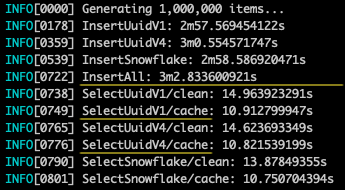

# Idempotency Key Performance Test

Test performance of different types of idempotency keys in Postgres:

- uuid v1 (`uuid` type): 16 bytes, monotonic increasing.
- uuid v4 (`uuid` type): 16 bytes, random.
- snowflake (`bigint` type): 8 bytes, monotonic increasing.


## Build

```
go build -o iktest ./...
```


## Run

### Run with local database

1. Start your local Postgres server.
 
2. Set environment variable `$DSN` for convenience:

   ```
   export DSN='postgres://iktest@localhost/iktest?sslmode=disable'
   ```

3. Run the program with 1,000 items:

   ```
   ./iktest $DSN -n 1000
   ```

4. Run the program in verbose mode:

   ```
   ./iktest $DSN -v
   ```

5. If everything is ok, run the program with 1,000,000 items:

   ```
   ./iktest $DSN -n 1000000
   ```

   You may see the output similar to this:
   

   
   

### Run with remote database

If the database server runs on a remote host, you need to clear the cache and restart it manually when needed.


1. Set environment variable `$DSN` for convenience:

   ```
   export DSN='postgres://iktest@example.com/iktest?sslmode=disable'
   ```


2. Run the program with `-p` flag:

   ```
   ./iktest $DSN -p
   ```

Every time you see the prompt:

   ```
   NOTE: Please clear PostgreSQL cache, and press ENTER when done...
   ```

You'll need to clear the database cache and restart it manually.  After that, press ENTER to resume the test program.


## LICENSE

Apache License 2.0.  See the [LICENSE](LICENSE) file.